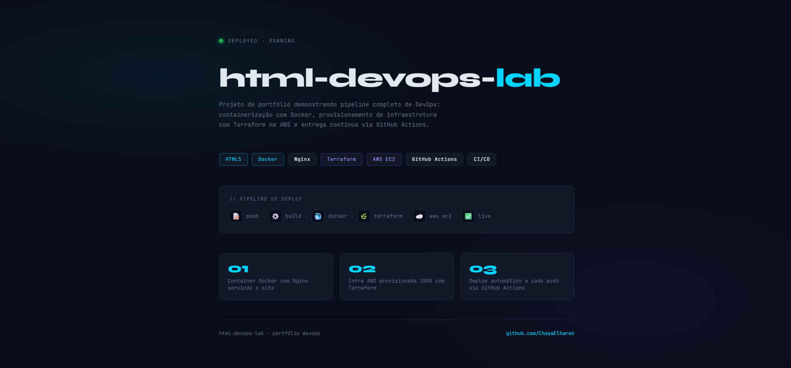
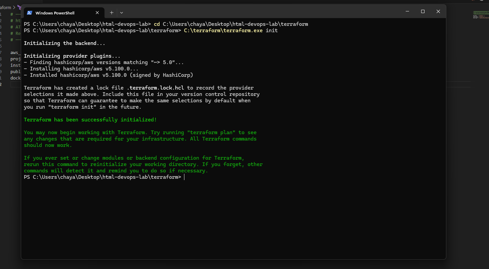

# html-devops-lab

[](https://github.com/ChayaElharek/html-devops-lab/actions/workflows/deploy.yml)


> Pipeline DevOps completo: site estático containerizado com Docker, infraestrutura provisionada com Terraform na AWS e deploy automatizado via GitHub Actions.

---

## 📸 Preview
### Site no ar na AWS


### Terraform apply — EC2 criada com sucesso


### Terraform init — provider AWS instalado


---

## 🏗️ Arquitetura

```
┌─────────────┐     git push     ┌─────────────────────┐
│  Developed  │ ───────────────► │   GitHub (main)      │
│  Locally    │                  └──────────┬──────────┘
└─────────────┘                             │
                                   GitHub Actions CI/CD
                                            │
                          ┌─────────────────┼─────────────────┐
                          ▼                                   ▼
                 ┌────────────────┐               ┌──────────────────┐
                 │  Docker Build  │               │   Deploy via SSH  │
                 │  + Push Hub    │               │   na AWS EC2      │
                 └────────────────┘               └──────────────────┘
                          │                                   │
                          ▼                                   ▼
                 ┌────────────────┐               ┌──────────────────┐
                 │   Docker Hub   │──── pull ────►│  Docker + Nginx  │
                 │  (registry)    │               │  porta 80 → site │
                 └────────────────┘               └──────────────────┘
```

---

## 🛠️ Stack

| Camada | Tecnologia | Função |
|--------|-----------|--------|
| Aplicação | HTML5 + CSS3 | Site estático |
| Container | Docker + Nginx Alpine | Empacotamento e servidor web |
| Registro | Docker Hub | Armazenamento da imagem |
| IaC | Terraform | Provisionamento da infra na AWS |
| Cloud | AWS EC2 (t3.micro) | Servidor de produção |
| CI/CD | GitHub Actions | Automação de build e deploy |

---

## 📁 Estrutura

```
html-devops-lab/
├── .github/
│   └── workflows/
│       └── deploy.yml        # Pipeline CI/CD completo
├── docs/
│   ├── ARCHITECTURE.md       # Diagrama e decisões de arquitetura
│   └── guia-git-vscode.md    # Guia de uso com VS Code
├── src/
│   └── index.html            # Site estático
├── terraform/
│   ├── main.tf               # Recursos AWS (EC2, SG, Key Pair)
│   ├── variables.tf          # Variáveis configuráveis
│   ├── outputs.tf            # Outputs (IP, URL, DNS)
│   └── terraform.tfvars.example
├── Dockerfile                # Imagem Nginx Alpine
├── docker-compose.yml        # Ambiente local
└── README.md
```

---

## ⚡ Rodando Localmente

```bash
# Clone o repositório
git clone https://github.com/ChayaElharek/html-devops-lab.git
cd html-devops-lab

# Suba com Docker Compose
docker-compose up -d

# Acesse em http://localhost:8080
```

---

## ☁️ Provisionando a Infra (Terraform)

```bash
cd terraform

# Copie e preencha as variáveis
cp terraform.tfvars.example terraform.tfvars

# Inicialize e aplique
terraform init
terraform plan
terraform apply

# O IP público aparece nos outputs ao final
```

Para destruir:
```bash
terraform destroy
```

---

## 🔄 Pipeline CI/CD

O pipeline dispara automaticamente a cada `push` para `main`:

| Step | Descrição |
|------|-----------|
| `Checkout` | Clona o repositório no runner |
| `Docker Login` | Autentica no Docker Hub |
| `Build & Push` | Builda a imagem e envia ao Docker Hub com tag `latest` e SHA do commit |
| `SSH Deploy` | Acessa a EC2, para o container antigo e sobe o novo |

### Secrets necessários

| Secret | Descrição |
|--------|-----------|
| `DOCKERHUB_USERNAME` | Usuário do Docker Hub |
| `DOCKERHUB_TOKEN` | Token de acesso do Docker Hub |
| `EC2_HOST` | IP público da instância EC2 |
| `EC2_SSH_KEY` | Chave privada SSH para acesso à EC2 |

---

## 📚 Conceitos Aplicados

- **Containerização** com Docker e Nginx Alpine
- **Infraestrutura como Código (IaC)** com Terraform
- **CI/CD** automatizado com GitHub Actions
- **Cloud Computing** na AWS (EC2, Security Groups, Key Pairs)
- **GitOps** — infra e aplicação versionadas no mesmo repositório
- **Segurança** — secrets gerenciados pelo GitHub, `.tfvars` no `.gitignore`

---

## 👩‍💻 Autora

**Chaya Elharek** — DevOps | Cloud Infrastructure
[](https://github.com/ChayaElharek)